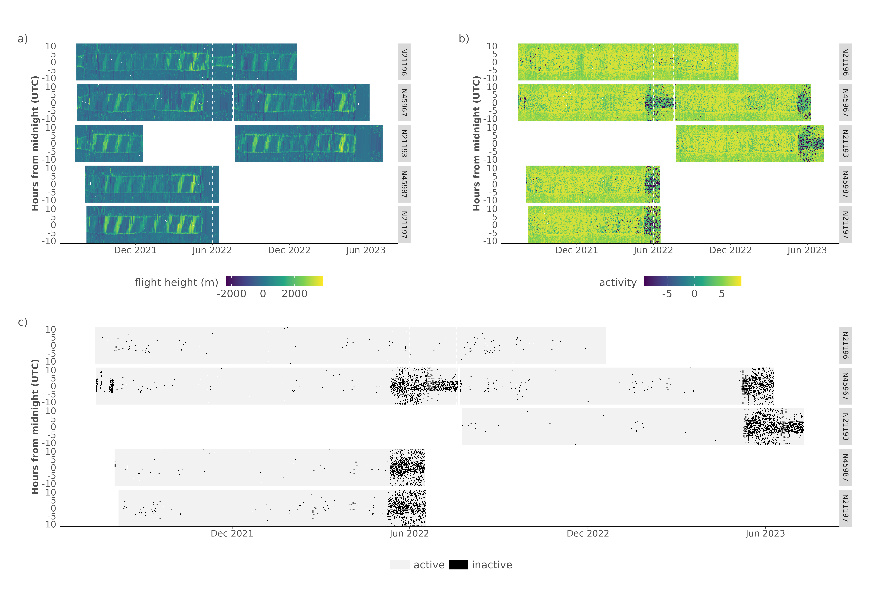
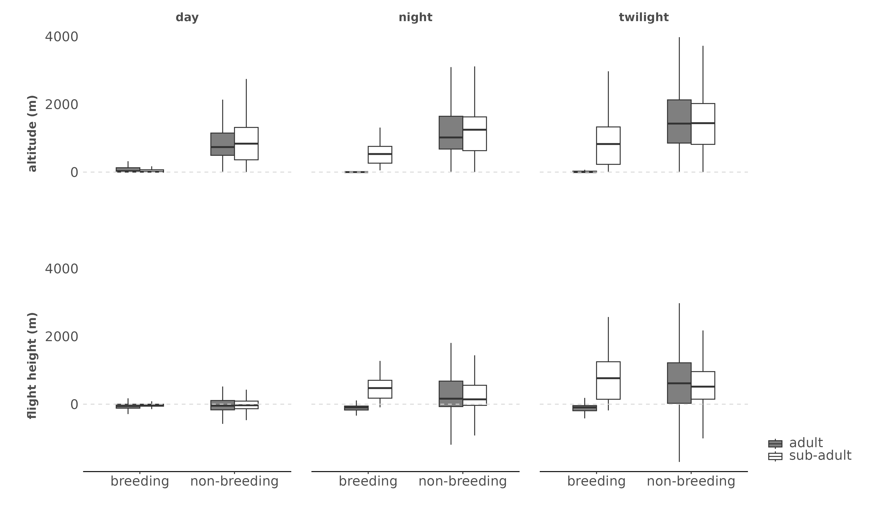

```{r setup, include = FALSE}
knitr::opts_chunk$set(
  collapse = TRUE,
  comment = "#>"
)
```

## Methods

We calculated the altitude (z) from pressure values using the international standard atmosphere (International Organizations for Standardization ISO 2533:1975) which is defined as:

$$ z = \frac{T_0}{L}*\left({\frac{P_0}{P}}^{\frac{LR_0}{g}} - 1\right)$$

With T~0~ the temperature at sea level (288.15 K), L the temperature lapse rate (-0.0065° K m^-1^), P~0~ the standard atmospheric pressure at sea level (1013.25 hPa), P the measured air pressure (hPa), g the gravitational acceleration (9.81 m s-1) and R0 the universal gas constant (287.053 J kg^-1^ K^-1^). 

Additional summary statistics to those described in the main manuscript are provided. We report mean average flight altitude and height, activity with their uncertainty (on standard deviation). Furthermore we tabulate current and/or long term swift recapture rates.

### Light pollution processing

The returned values from Fachi et al. (2019) in candella (mcd/m2) are converted to approximate values in lux using the approximation of I = π * (L * 0.001), where I is illuminance in candella and L is zenith luminance following Kyba et al. (2017).
Data are further scaled to sky glow using a fixed ten-fold multiplier scaled by ERA5-land cloud cover fraction (0 - 1). To assess the influence of light pollution around the Belgian nesting colony we compare the maximum value in a 5 km radius around the colony with data collected in a region with lower light pollution levels. We used the location used in the assessment of nighttime sub-adult flight behaviour as described in the radar study of Nilsson et al. (2019) and extracted sky brightness values in a 5 km radius, corresponding to the radar footprint. In addition, we calculate the solar angle (per minute) for the six days on which radar data were recorded. Total nighttime per day was calculated as the time with sun elevations below -12 degrees.

### Modelled illuminance responses

Flight height responses in relation to changing moon illuminance values were modelled using an ordinary nonlinear least-squares method and an asymptotic exponential model of the form, flight height = C * (1 - e^k*illuminance^ ). Where C is the maximum (asymptotic) flight height and k modules an exponential response to illuminance (either natural or anthropogenic). Parameter values were constrained between  -2000 and 4000 m for the maximum (asymptotic) flight height C and between -Inf and 0 for the exponential factor k. Only flight height values between October and May during nighttime (excluding all twilight phases), not marked as migratory movements, were considered.

## Figures

```{r echo=FALSE, fig.cap="Figure S1. Actograms of all tagged swifts showing both flight height (normalized altitudes relative to daytime flights) a) and registered log transformed activity values b) and approximate indications of active or inactive behaviour for times where flight heights are negative (below the daytime mean) and activity is lower than 10 (on a scale of 0 to ~5000). Multiple birds have been logged with different tags (but the same ring number) are here plotted on the same time axis (see Table 1). The swift with tag CC894 (ring N21196) is shown in the top panel of each subplot. We note the differences in both the flight height dynamics and activity values between N21196 and more stationary breeding birds (as shown by darker activity values).", out.width="100%"}

```

```{r echo=FALSE, fig.cap="Figure S2. Boxplots of flight altitudes and flight heights according to day, night and twilight periods for both adult and sub-adults swifts. General correspondence between adults and sub-adults is seen during the non-breeding season in the altitude and flight heights. We note marked changes in nighttime patterns due to the roosting of adult swifts during the breeding season. We also note a decrease in flight altitudes relative to the non-breeding season, while flight heights for the sub-adults remain similar. In short, baseline flight altitude values (a reference to calculate flight heights) during daytime are higher as seen in the top left panel.", out.width="100%"}

```

```{r echo=FALSE, fig.cap="Figure S3. Sky brightness and sky glow values (10x sky brightness) under cloud cover for Belgium (in lux). The Ghent harbor colony and general surroundings is marked with an open round circle. Sky glow values in white exceed the threshold triggering an increased light driven flight response.", out.width="100%"}
knitr::include_graphics("figures/sky_glow.png")
```
